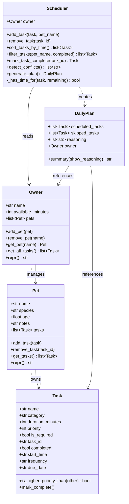

# PawPal+ Final UML — Class Diagram

Paste the Mermaid code below into https://mermaid.live to render and export as PNG.

## Key changes from initial design

| Initial | Final | Reason |
|---|---|---|
| `Pet` was a dataclass with no tasks | `Pet` is a regular class that owns `list[Task]` | Tasks belong to pets, not the scheduler |
| `Owner` held one pet | `Owner` manages `list[Pet]` | Multi-pet support added |
| `Scheduler` held its own task list | `Scheduler` reads tasks from `owner.pets` | Removes duplicate state |
| `Task` had 6 fields | `Task` has 10 fields | Added `completed`, `start_time`, `frequency`, `due_date` for Phase 3 features |
| `Scheduler` had 4 methods | `Scheduler` has 8 methods | Added sorting, filtering, recurrence, conflict detection |
| `DailyPlan` held `owner` + `pet` | `DailyPlan` holds only `owner` | Multi-pet makes pet-level reference wrong scope |
